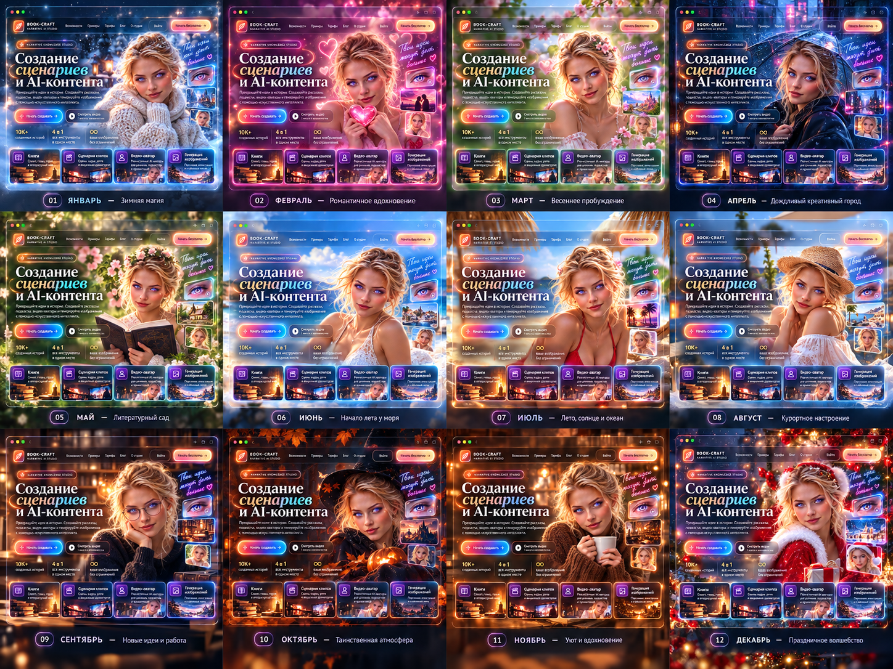
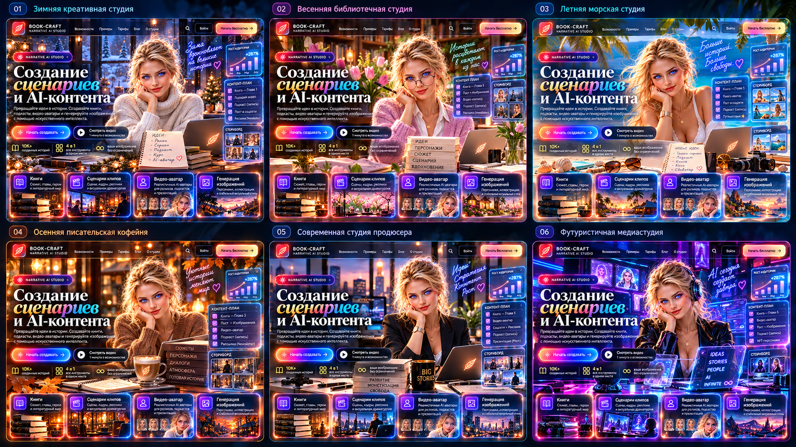

# BOOK-CRAFT visual assets

Каркас сайта зафиксирован. Эта папка хранит только сменные визуальные ассеты.

## Правила

- не запекаем в изображения меню, кнопки, HUD, аналитику и финальный UI-текст;
- React остаётся источником интерактивности;
- hero/background/cards/props храним раздельно;
- неопределённые изображения не угадываем — оставляем кандидатами до визуального ревью.

## Структура

- `hero/` — главный персонаж и кандидаты;
- `backgrounds/` — окружение;
- `cards/` — финальные изображения карточек;
- `props/` — предметные слои;
- `modules/` — внутренние страницы;
- `references/` — утверждённые и исторические референсы;
- `candidates/` — ещё не распределённые BOOK-CRAFT варианты;
- `manifest.json` — контракт runtime-слотов.

## Visual catalog

### Hero

`hero/candidates/hero-main-v1.png` — CANDIDATE.

### Historical references

**01**  
  
`references/2026-09-26/reference-20260926-144904.png`

**02**  
  
`references/2026-09-26/reference-20260926-150710.png`

**03**  
  
`references/2026-09-26/reference-20260926-205559.png`

**04**  
  
`references/2026-09-26/reference-20260926-223709-1.png`

**05**  
  
`references/2026-09-26/reference-20260926-223712-2.png`

**06**  
  
`references/2026-09-26/reference-20260926-223914.png`

### Current BOOK-CRAFT candidates

**01**  
  
`candidates/2026-09-28/bookcraft-20260928-171126-1.png`

**02**  
  
`candidates/2026-09-28/bookcraft-20260928-171128-2.png`

**03**  
  
`candidates/2026-09-28/bookcraft-20260928-171130-3.png`

**04**  
  
`candidates/2026-09-28/bookcraft-20260928-171133-4.png`

**05**  
  
`candidates/2026-09-28/bookcraft-20260928-131124.png`

**06**  
  
`candidates/2026-09-28/bookcraft-20260928-131146.png`

**07**  
  
`candidates/2026-09-28/bookcraft-20260928-131148.png`

**08**  
  
`candidates/2026-09-28/bookcraft-20260928-131155.png`

**09**  
  
`candidates/2026-09-28/bookcraft-20260928-131157.png`

**10**  
  
`candidates/2026-09-28/bookcraft-20260928-132035.png`

**11**  
  
`candidates/2026-09-28/bookcraft-20260928-132432.png`

**12**  
  
`candidates/2026-09-28/bookcraft-20260928-132439.png`

**13**  
  
`candidates/2026-09-28/bookcraft-20260928-132449.png`

**14**  
  
`candidates/2026-09-28/bookcraft-20260928-133647.png`

Full source→destination history is in [../ASSET_MOVE_LOG.md](../ASSET_MOVE_LOG.md).

