# FATHER visual assets

Scope: FATHER platform visuals

## Statuses

- SELECTED — active chosen asset
- CANDIDATE — usable candidate
- REFERENCE — reference only
- NEEDS_VISUAL_REVIEW — cannot be safely classified from filename alone

## Folders

- `brand/` — брендовые материалы;
- `intake/` — загруженные кандидаты, ожидающие тематического визуального разбора;
- later: `hero/`, `agents/`, `architecture/`, `dashboards/`, `illustrations/`.

## Visual catalog

### Brand

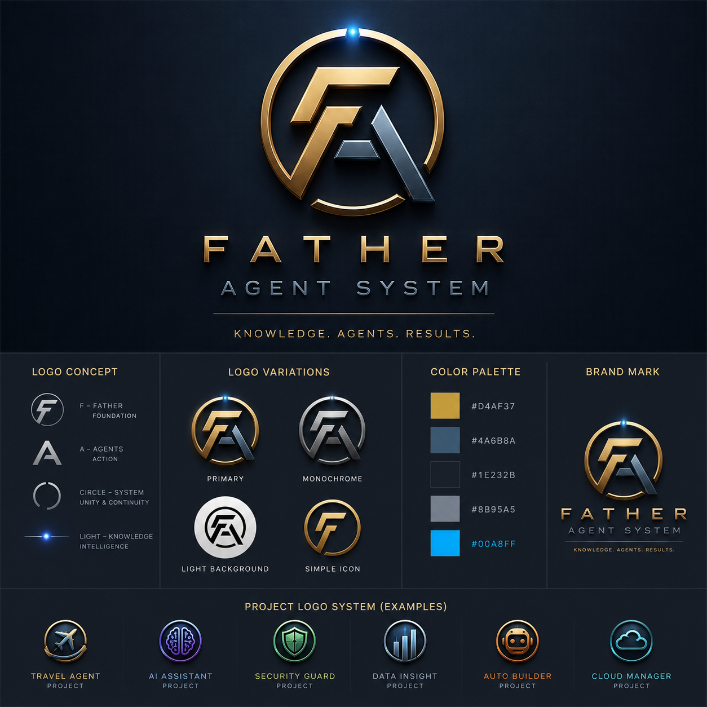

`brand/father-agent-system-brand.png` — SELECTED.

### FATHER candidates awaiting semantic placement

**01**  
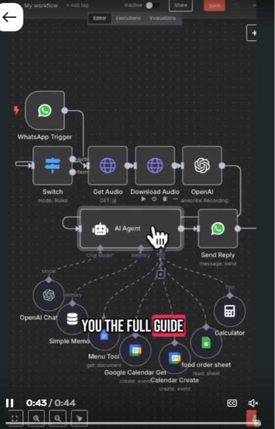  
`intake/2026-09/father-20260927-225207.png`

**02**  
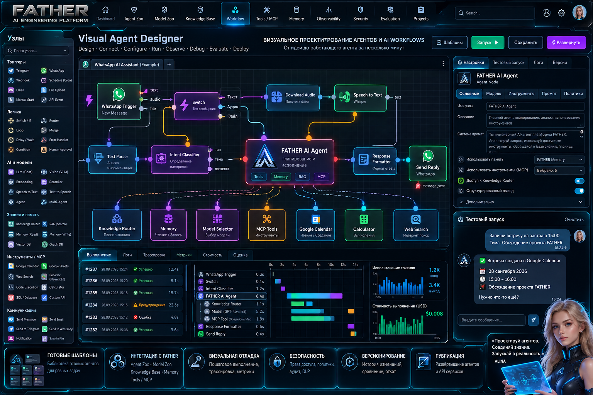  
`intake/2026-09/father-20260927-230801.png`

**03**  
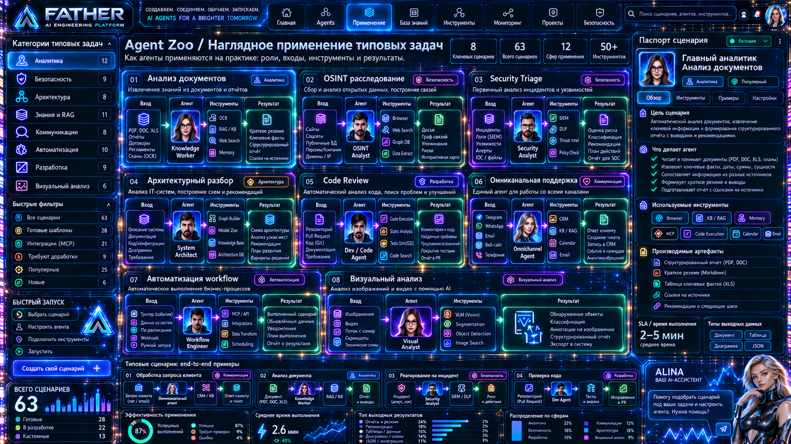  
`intake/2026-09/father-20260928-103558.png`

**04**  
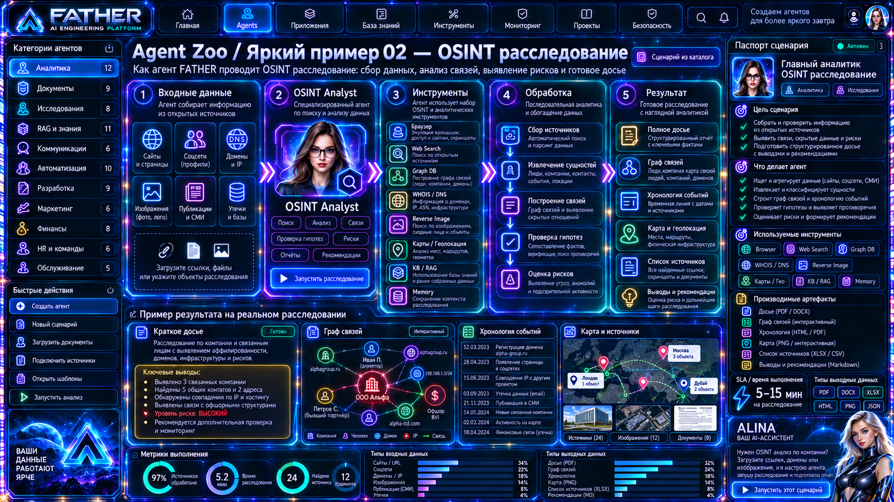  
`intake/2026-09/father-20260928-114650.png`

**05**  
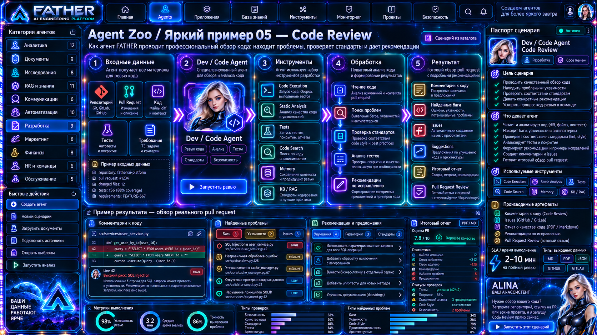  
`intake/2026-09/father-20260928-114712.png`

**06**  
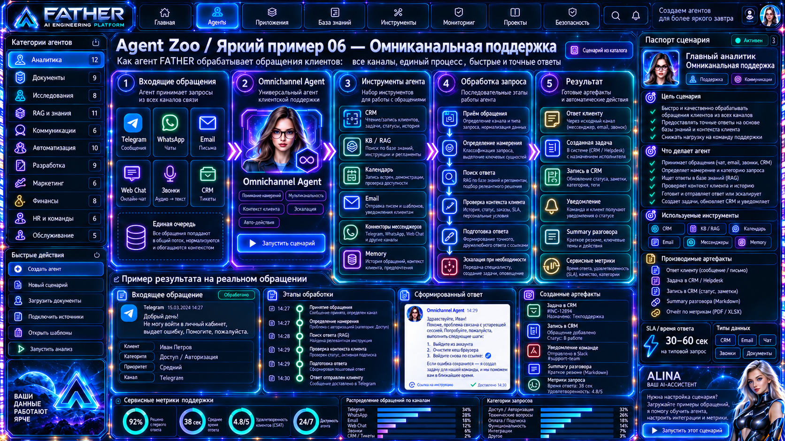  
`intake/2026-09/father-20260928-114715.png`

**07**  
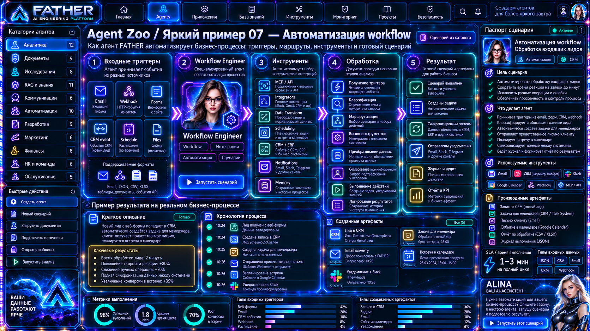  
`intake/2026-09/father-20260928-114722.png`

**08**  
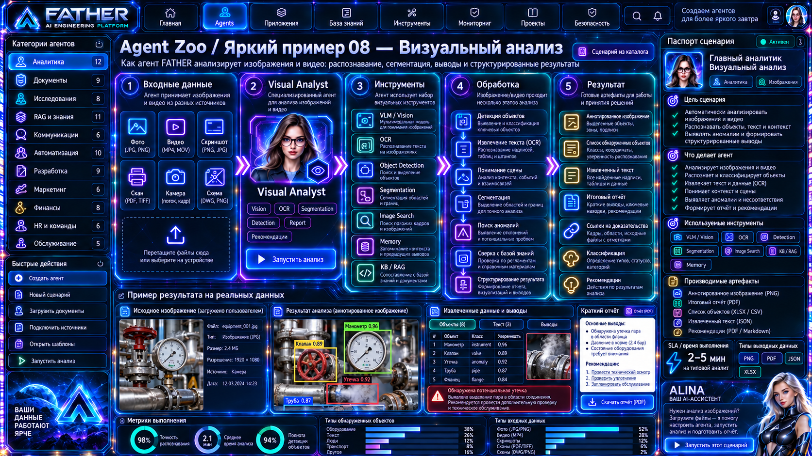  
`intake/2026-09/father-20260928-114727.png`

**09**  
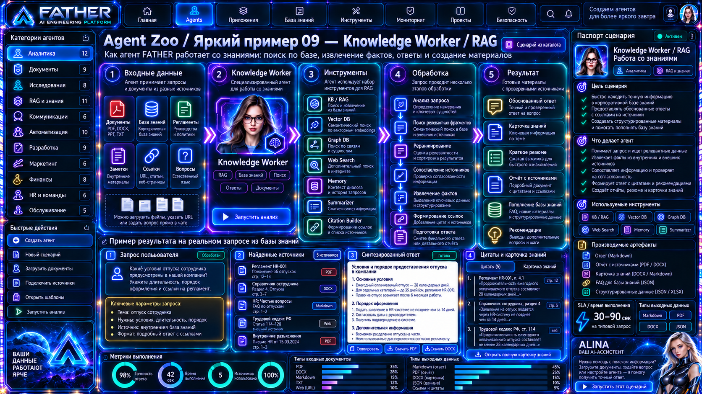  
`intake/2026-09/father-20260928-114736.png`

**10**  
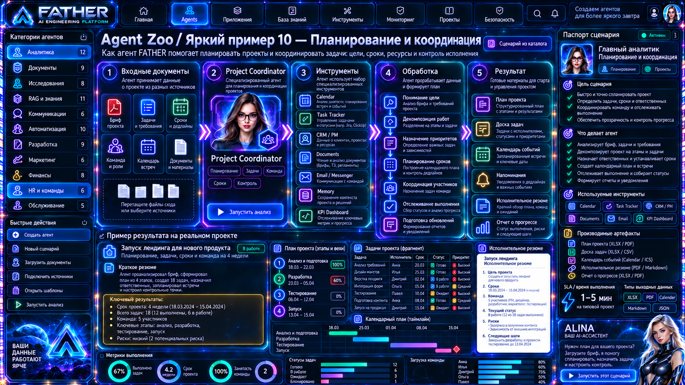  
`intake/2026-09/father-20260928-114743.png`

**11**  
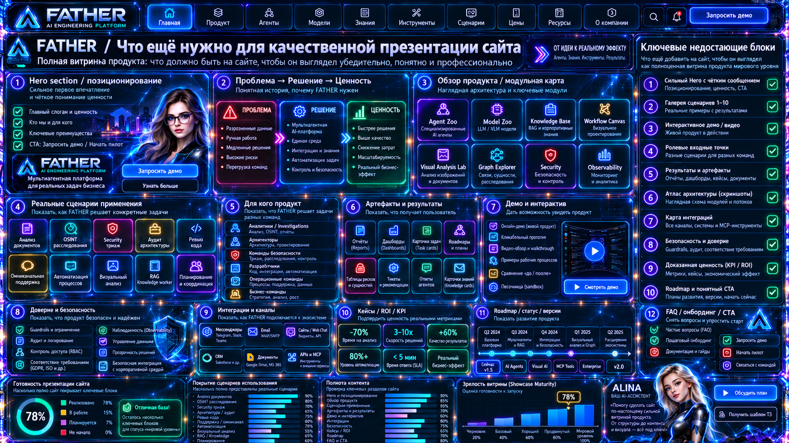  
`intake/2026-09/father-20260928-115944.png`

These files are already assigned to FATHER, but their final role (hero, agent, architecture, dashboard, illustration, etc.) will be fixed after visual review.

